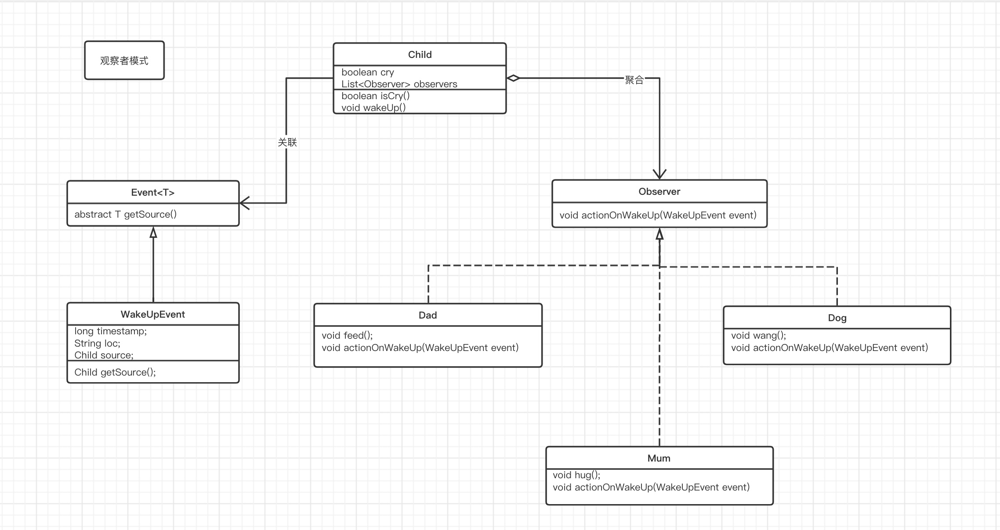

主要讲Observer模式的演变过程


------


##### 面向过程的观察者 -- v1

``` java
	public static void main(String[] args) {
        boolean cry = false;
    		// baby 开始哭, 就处理
        while(!cry) {
            //进行处理
        }
    }
```


------


##### 面向对象傻等的观察者 -- v2

``` java
class Child {
    private boolean cry = false;

    public boolean isCry() {
        return cry;
    }

    public void wakeUp() {
        System.out.println("Waked Up! Crying wuwuwuwu...");
        cry = true;
    }
}

public class Main {
    public static void main(String[] args) {
        Child child = new Child();
        while(!child.isCry()) {
            try {
                Thread.sleep(1000);
            } catch (InterruptedException e) {
                e.printStackTrace();
            }
            System.out.println("observing...");
        }

    }
}
```


------


##### 加入观察者 -- v3

``` java
class Child {
    private boolean cry = false;
    private Dad d = new Dad();

    public boolean isCry() {
        return cry;
    }

    public void wakeUp() {
        cry = true;
        d.feed();
    }
}

class Dad {
    public void feed() {
        System.out.println("dad feeding...");
    }
}

public class Main {
    public static void main(String[] args) {
        Child c = new Child();
        //do sth
        c.wakeUp();
    }
}
```


------


##### 加入多个观察者 -- v4

``` java
class Child {
    private boolean cry = false;
    private Dad dad = new Dad();
    private Mum mum = new Mum();
    private Dog dog = new Dog();


    public boolean isCry() {
        return cry;
    }

    public void wakeUp() {
        cry = true;
        dad.feed();
        dog.wang();
        mum.hug();
    }
}

class Dad {
    public void feed() {
        System.out.println("dad feeding...");
    }
}

class Mum {
    public void hug() {
        System.out.println("mum hugging...");
    }
}

class Dog {
    public void wang() {
        System.out.println("dog wang...");
    }
}

public class Main {
    public static void main(String[] args) {
        Child c = new Child();
        //do sth
        c.wakeUp();
    }
}
```


------


##### 分离观察者和被观察者 -- v5

耦合程度:  继承(is a) > 聚合(has a) > 关联 .   聚合: 以属性的形式出现,   关联: 以函数参数,返回值的形式出现

``` java
class Child {
    private boolean cry = false;
    private List<Observer> observers = new ArrayList<>();

    {
        observers.add(new Dad());
        observers.add(new Mum());
        observers.add(new Dog());
    }


    public boolean isCry() {
        return cry;
    }

    public void wakeUp() {
        cry = true;
        for(Observer o : observers) {
            o.actionOnWakeUp();
        }
    }
}

interface Observer {
    void actionOnWakeUp();
}

class Dad implements Observer {
    public void feed() {
        System.out.println("dad feeding...");
    }

    @Override
    public void actionOnWakeUp() {
        feed();
    }
}

class Mum implements Observer {
    public void hug() {
        System.out.println("mum hugging...");
    }

    @Override
    public void actionOnWakeUp() {
        hug();
    }
}

class Dog implements Observer {
    public void wang() {
        System.out.println("dog wang...");
    }

    @Override
    public void actionOnWakeUp() {
        wang();
    }
}

public class Main {
    public static void main(String[] args) {
        Child c = new Child();
        //do sth
        c.wakeUp();
    }
}
```


------


##### 观察者根据具体事件来处理 -- v6

分离出事件类,  传给观察者具体事件

``` java
// 事件源
class Child { 
    private boolean cry = false;
    private List<Observer> observers = new ArrayList<>();

    {
        observers.add(new Dad());
        observers.add(new Mum());
        observers.add(new Dog());
    }


    public boolean isCry() {
        return cry;
    }

    public void wakeUp() {
        cry = true;

        wakeUpEvent event = new wakeUpEvent(System.currentTimeMillis(), "bed");

        for(Observer o : observers) {
            o.actionOnWakeUp(event);
        }
    }
}

//事件类 fire Event
class wakeUpEvent{ 
    long timestamp;
    String loc;

    public wakeUpEvent(long timestamp, String loc) {
        this.timestamp = timestamp;
        this.loc = loc;
    }
}

// 观察者
interface Observer {
    void actionOnWakeUp(wakeUpEvent event);
}

class Dad implements Observer {
    public void feed() {
        System.out.println("dad feeding...");
    }

    @Override
    public void actionOnWakeUp(wakeUpEvent event) {
        feed();
    }
}

class Mum implements Observer {
    public void hug() {
        System.out.println("mum hugging...");
    }

    @Override
    public void actionOnWakeUp(wakeUpEvent event) {
        hug();
    }
}

class Dog implements Observer {
    public void wang() {
        System.out.println("dog wang...");
    }

    @Override
    public void actionOnWakeUp(wakeUpEvent event) {
        wang();
    }
}

public class Main {
    public static void main(String[] args) {
        Child c = new Child();
        //do sth
        c.wakeUp();
    }
}
```


------


##### 处理事件时, 有时需要用到事件源对象 -- v7

在事件中聚合事件源, 创建事件对象时, 传入事件源

``` java
class Child {
    private boolean cry = false;
    private List<Observer> observers = new ArrayList<>();

    {
        observers.add(new Dad());
        observers.add(new Mum());
        observers.add(new Dog());
    }


    public boolean isCry() {
        return cry;
    }

    public void wakeUp() {
        cry = true;

        wakeUpEvent event = new wakeUpEvent(System.currentTimeMillis(), "bed", this);

        for(Observer o : observers) {
            o.actionOnWakeUp(event);
        }
    }
}

class wakeUpEvent{
    long timestamp;
    String loc;
    Child source;

    public wakeUpEvent(long timestamp, String loc, Child source) {
        this.timestamp = timestamp;
        this.loc = loc;
        this.source = source;
    }
}

interface Observer {
    void actionOnWakeUp(wakeUpEvent event);
}

class Dad implements Observer {
    public void feed() {
        System.out.println("dad feeding...");
    }

    @Override
    public void actionOnWakeUp(wakeUpEvent event) {
        feed();
    }
}

class Mum implements Observer {
    public void hug() {
        System.out.println("mum hugging...");
    }

    @Override
    public void actionOnWakeUp(wakeUpEvent event) {
        hug();
    }
}

class Dog implements Observer {
    public void wang() {
        System.out.println("dog wang...");
    }

    @Override
    public void actionOnWakeUp(wakeUpEvent event) {
        wang();
    }
}

public class Main {
    public static void main(String[] args) {
        Child c = new Child();
        //do sth
        c.wakeUp();
    }
}
```

#####  

------


##### 事件也可以形成继承体系 -- v8

抽象出Event类及其WakeUpEvent子类

``` java
class Child {
    private boolean cry = false;
    private List<Observer> observers = new ArrayList<>();

    {
        observers.add(new Dad());
        observers.add(new Mum());
        observers.add(new Dog());
        observers.add((e)->{
            System.out.println("ppp");
        });
        //hook callback function
    }


    public boolean isCry() {
        return cry;
    }

    public void wakeUp() {
        cry = true;

        wakeUpEvent event = new wakeUpEvent(System.currentTimeMillis(), "bed", this);

        for(Observer o : observers) {
            o.actionOnWakeUp(event);
        }
    }
}

abstract class Event<T> {
    abstract T getSource();
}

class wakeUpEvent extends Event<Child>{
    long timestamp;
    String loc;
    Child source;

    public wakeUpEvent(long timestamp, String loc, Child source) {
        this.timestamp = timestamp;
        this.loc = loc;
        this.source = source;
    }

    @Override
    Child getSource() {
        return source;
    }
}

interface Observer {
    void actionOnWakeUp(wakeUpEvent event);
}

class Dad implements Observer {
    public void feed() {
        System.out.println("dad feeding...");
    }

    @Override
    public void actionOnWakeUp(wakeUpEvent event) {
        feed();
    }
}

class Mum implements Observer {
    public void hug() {
        System.out.println("mum hugging...");
    }

    @Override
    public void actionOnWakeUp(wakeUpEvent event) {
        hug();
    }
}

class Dog implements Observer {
    public void wang() {
        System.out.println("dog wang...");
    }

    @Override
    public void actionOnWakeUp(wakeUpEvent event) {
        wang();
    }
}

public class Main {
    public static void main(String[] args) {
        Child c = new Child();
        //do sth
        c.wakeUp();
    }
}
```


观察者模式UML图




------


##### Observer在JDK中的应用模拟 -- v9

模拟awt包中Button被点击, 添加动作监听类,  点击事件类, 响应过程

``` java
public class Test {
	public static void main(String[] args) {
		Button b = new Button();
		b.addActionListener(new MyActionListener());
		b.addActionListener(new MyActionListener2());
		b.buttonPressed();
	}
}

// 事件源
class Button {
	// 观察者集合
	private List<ActionListener> actionListeners = new ArrayList<ActionListener>();
	// 事件源产生按钮点击事件
	public void buttonPressed() {
		ActionEvent e = new ActionEvent(System.currentTimeMillis(),this);
		for(int i=0; i<actionListeners.size(); i++) {
			ActionListener l = actionListeners.get(i);
			l.actionPerformed(e);
		}
	}
	
	public void addActionListener(ActionListener l) {
		actionListeners.add(l);
	}
}

// 监听者 --> 观察者
interface ActionListener {
	public void actionPerformed(ActionEvent e);
}

class MyActionListener implements ActionListener {

	public void actionPerformed(ActionEvent e) {
		System.out.println("button pressed!");
	}
	
}

class MyActionListener2 implements ActionListener {

	public void actionPerformed(ActionEvent e) {
		System.out.println("button pressed 2!");
	}
	
}

// 事件对象
class ActionEvent {
	
	long when;
	Object source;
	
	public ActionEvent(long when, Object source) {
		super();
		this.when = when;
		this.source = source;
	}
	
	
	public long getWhen() {
		return when;
	}

	public Object getSource() {
		return source;
	}
	
}
```

``` java
public class TestFrame extends Frame {
	public void launch() {
		Button b = new Button("press me");
		b.addActionListener(new MyActionListener());
		b.addActionListener(new MyActionListener2());
		this.add(b);
		this.pack();
		
		this.addWindowListener(new WindowAdapter(){

			@Override
			public void windowClosing(WindowEvent e) {
				System.exit(0);
			}
			
		});
		this.setLocation(400, 400);
		this.setVisible(true);
	}
	
	public static void main(String[] args) {
		new TestFrame().launch();
	}
	
	private class MyActionListener implements ActionListener { //Observer

		public void actionPerformed(ActionEvent e) {
			((Button)e.getSource()).setLabel("press me again!");
			System.out.println("button pressed!");
		}
		
	}
	
	private class MyActionListener2 implements ActionListener {

		public void actionPerformed(ActionEvent e) {
			System.out.println("button pressed 2!");
		}
		
	}
}
```

